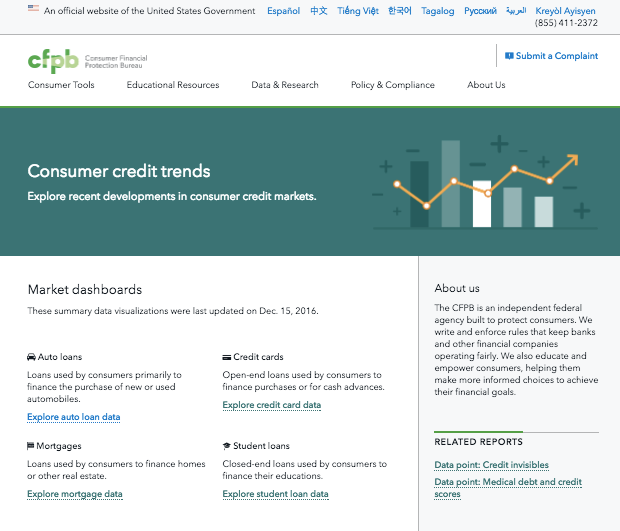

# consumer-credit-trends-data

## Explore recent developments in consumer credit markets
This data appears on http://www.consumerfinance.gov/data-research/consumer-credit-trends/ powering graphs for each featured credit market.

## We want your feedback, but will not be able to respond to everyone
We want as much feedback as possible to help us make informed decisions so that we can make this tool better. Unfortunately, we will not be able to respond to every piece of feedback or comment we receive, but intend to respond with our progress through the evolution of the tool.

## Contents

1. Folders per released market containing CSV and JSON files, using a schema described below.
  1. JSON files are rendered on our live site using https://github.com/cfpb/cfpb-chart-builder, an extension of Highcharts.
1. `process_incoming_data.py` transforms internal Office of Research summary CSVs into a more user-readable format.

## Data schema

Markets:

<table id="suffix">
  <tbody>
    <tr>
      <th>Definition</th>
      <th>Folder</th>
      <th>File Suffix</th>
    </tr>
    <tr>
      <td>Auto loans</td>
      <td>auto-loans</td>
      <td>AUT</td>
    </tr>
    <tr>
      <td>Credit card</td>
      <td>credit-cards</td>
      <td>CRC</td>
    </tr>
    <tr>
      <td>Mortgages</td>
      <td>mortgages</td>
      <td>MTG</td>
    </tr>
    <tr>
      <td>Student loans</td>
      <td>student-loans</td>
      <td>STU</td>
    </tr>
  </tbody>
</table>

Filenames contain prefixes that represent the type of aggregate data, and suffixes that represent the type of market the data describes.

<table id="prefix">
  <tbody>
    <tr>
      <th>File Prefix</th>
      <th>Description</th>
    </tr>
    <tr>
      <td>map_data</td>
      <td>Geographic map data containing year-over-year changes for each U.S. state</td>
    </tr>
    <tr>
      <td>num_data</td>
      <td>Number of new loan originations</td>
    </tr>
    <tr>
      <td>vol_data</td>
      <td>Loan volume in dollars</td>
    </tr>
    <tr>
      <td>volume_data_Age_Group</td>
      <td>Loan volume in dollars by age group</td>
    </tr>
    <tr>
      <td>volume_data_yoy_data_Income_Level</td>
      <td>Loan volume in dollars by income level</td>
    </tr>
    <tr>
      <td>volume_data_Score_Level</td>
      <td>Loan volume in dollars by credit score group</td>
    </tr>
    <tr>
      <td>yoy_data_all</td>
      <td>Year-over-year percentage change in new loan originations</td>
    </tr>
    <tr>
      <td>yoy_data_Age_Group</td>
      <td>Year-over-year percentage change in new loan originations by age group</td>
    </tr>
    <tr>
      <td>yoy_data_Income_Level</td>
      <td>Year-over-year percentage change in new loan originations by income level group</td>
    </tr>
    <tr>
      <td>yoy_data_Score_Level</td>
      <td>Year-over-year percentage change in new loan originations by credit score group</td>
    </tr>
  </tbody>
</table>
