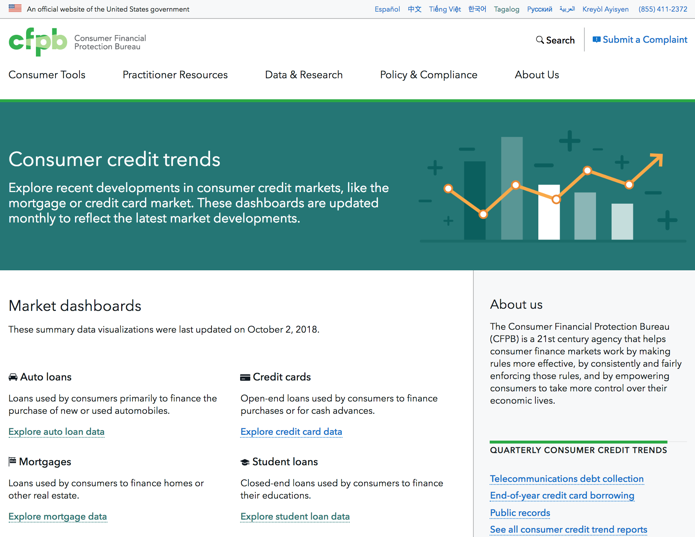

# Consumer Credit Trends

## Explore recent developments in consumer credit markets
The data files in this repo appear on [the live Consumer Credit Trends site here](https://www.consumerfinance.gov/data-research/consumer-credit-trends/) powering graphs for each featured credit market, as shown in this screenshot.

This site displays graphs for several consumer credit markets:

- Auto loans
- Credit cards
- Mortgages
- Student loans

For each market, credit information includes:

- Market summaries for volume, value, and geographic changes
- Lending levels by certain demographic breakdowns
    - Borrower risk profile (credit score)
    - Neighborhood income level
    - Borrower age
- Inquiry activity
    - Credit inquiries
    - Credit tightness

## What's in this repository

### Data files

Data is organized into per-market folders. Provided data files include:

- CSV files of the data for download
- JSON files which are rendered on [the live site](https://www.consumerfinance.gov/data-research/consumer-credit-trends/) using [cfpb-chart-builder](https://github.com/cfpb/cfpb-chart-builder)

### Python files

The Python 2 based script processes raw data from our Office of Research into the output data files contained in this repo. These raw data files are internal-only and are anonymized summaries produced by the Consumer Credit Panel.

- `process_incoming_data.py` - Overall processing script
- `process_globals.py` - Configuration settings for data processing
- `process_utils.py` - Reusable utility functions, e.g. number/date conversions and reading/writing data/csv/json files

## Data schema

### Markets by folder or filename suffix

Data is organized into per-market folders.
The suffix of each file indicates the credit market.

<table id="suffix">
  <tbody>
    <tr>
      <th>Market</th>
      <th>Folder</th>
      <th>File Suffix</th>
    </tr>
    <tr>
      <td>Auto loans</td>
      <td>auto-loans</td>
      <td>AUT</td>
    </tr>
    <tr>
      <td>Credit card</td>
      <td>credit-cards</td>
      <td>CRC</td>
    </tr>
    <tr>
      <td>Mortgages</td>
      <td>mortgages</td>
      <td>MTG</td>
    </tr>
    <tr>
      <td>Student loans</td>
      <td>student-loans</td>
      <td>STU</td>
    </tr>
  </tbody>
</table>

### Types of data by filename prefix

The prefix of each file indicates type of aggregate data.
This table lists these prefixes alphabetically.

<table id="prefix">
  <tbody>
    <tr>
      <th>File Prefix</th>
      <th>Description</th>
    </tr>
    <tr>
      <td>crt_</td>
      <td>Number of consumers who applied for credit each month 
      and did not obtain additional credit  
      Values are indexed to January 2009</td>
    </tr>
    <tr>
      <td>inq_</td>
      <td>Number of consumers with credit inquiries  
      Values are indexed to January 2009</td>
    </tr>
    <tr>
      <td>map_data_</td>
      <td>Geographic map data containing year-over-year changes 
      for each U.S. state</td>
    </tr>
    <tr>
      <td>num_data_</td>
      <td>Number of new loan originations</td>
    </tr>
    <tr>
      <td>vol_data_</td>
      <td>Loan volume in dollars</td>
    </tr>
    <tr>
      <td>volume_data_Age_Group_</td>
      <td>Loan volume in dollars,
      broken out by the borrower's age group demographics</td>
    </tr>
    <tr>
      <td>volume_data_yoy_data_Income_Level_</td>
      <td>Loan volume in dollars, 
      broken out  by the borrower's income level relative to their 
      neighborhood's income level</td>
    </tr>
    <tr>
      <td>volume_data_Score_Level_</td>
      <td>Loan volume in dollars, 
      broken out by the borrower's credit score group</td>
    </tr>
    <tr>
      <td>yoy_data_all_</td>
      <td>Year-over-year percentage change in new loan originations</td>
    </tr>
    <tr>
      <td>yoy_data_Age_Group_</td>
      <td>Year-over-year percentage change in new loan originations, broken out by the borrower's age group demographics</td>
    </tr>
    <tr>
      <td>yoy_data_Income_Level_</td>
      <td>Year-over-year percentage change in new loan originations,
      broken out by the borrower's income level relative to their
      neighborhood's income level</td>
    </tr>
    <tr>
      <td>yoy_data_Score_Level_</td>
      <td>Year-over-year percentage change in new loan originations,
      broken out by the borrower's credit score group</td>
    </tr>
  </tbody>
</table>
